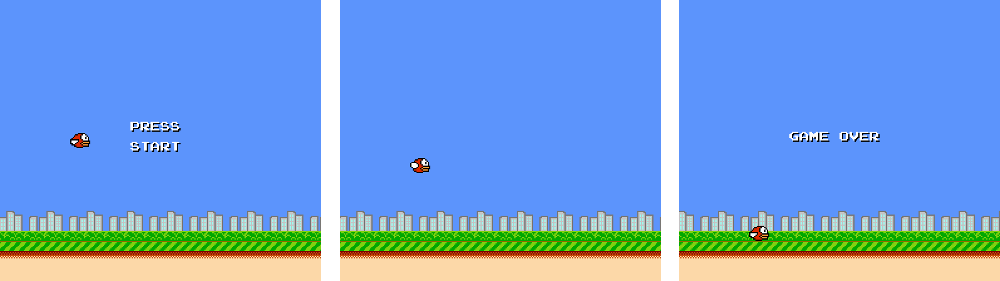

# Flappy Bird NES

This project is an attempt to create a clone of Flappy Bird for the Nintendo
Entertainment System.  The project can be run through a NES emulator, such
as [FCEUX](http://www.fceux.com).



## Project Details

### Assembler

The assembler being used is the somewhat controversial `nesasm` assembler
(I have version 2.51).  To assemble using `nesasm`:

```shell
  $ cd flappy-bird-nes # if not already in the project directory
  $ nesasm flappy-bird.asm
```

`nesasm` doesn't allow you to specify an output file - the generated file will be located wherever you ran `nesasm` from, and will be original filename with a `.nes` extension.  For this reason, you may want to use this command instead (which just simply moves the output file into the `dist` folder):

```shell
  $ nesasm flappy-bird.asm && mv flappy-bird.nes dist/
```

**Note:** I had some difficulty locating the Linux version of `nesasm` recently, but found a copy as part of a dev kit [here](http://www.magicengine.com/mkit/download.html).  Once you get the `nesasm` binary, ensure it's in your `$PATH`, and has execute permissions.

### How To Run

Inside the `dist` folder, you will find a `flappy-bird.nes`, which can be run using an emulator.  I use, and have tested the ROM, with [FCEUX](http://www.fceux.com/web/home.html).

For assembling the project yourself, see the section above.

### Progress

The project so far:

- There is:
    - a start screen
    - background scrolling
    - an animated bird
    - gravity
    - ability to flap - press 'A'
    - a game over state - currently only triggered when the bird wipes out by
      ploughing into the ground
- There is not:
    - any pipes to avoid
    - sound

## Notes

- This project was created as a personal learning excercise
- The code is well commented, but I would advise against using it as a learning
tool for NES development - I don't really know what I'm doing when it comes to
NES development (or assembly for that matter), so there will be few (if any)
occurences of best practices being used in the code.
- With the above in mind, a great resource for learning NES development is the
popular [Nerdy Nights tutorials](http://nintendoage.com/forum/messageview.cfm?catid=22&threadid=7155)
- Known issues:
  - if the bird goes above the top of the screen, the 'Game Over' state is triggered
