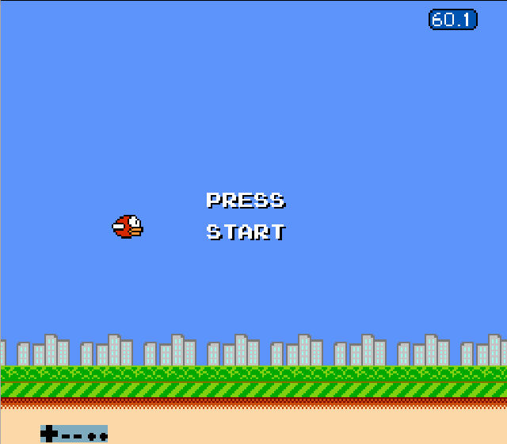

# Flappy Bird NES

This project is an attempt to create a clone of Flappy Bird for the Nintendo
Entertainment System.  The project can be run through a NES emulator, such
as [FCEUX](http://www.fceux.com).




## Project Details

### Assembler

The assembler being used is the somewhat controversial `nesasm` assembler
(I have version 2.51).  Assuming `nesasm` is available on your `$PATH`, run the following to assemble the project:

```bash
cd src/
make
```

This will create the file `flappy-bird.nes` in the `dist/` directory.

To make and run the project in one step, you can use `make run`, but you will need to have [`fceuxdsp`](http://www.romhacking.net/utilities/256/) on your `$PATH`.  You could of course edit `Makefile` to
use your preferred emulator if you wish.

**Note:** I had some difficulty locating the Linux version of `nesasm` recently, but found a copy as part of a dev kit [here](http://www.magicengine.com/mkit/download.html).  Once you get the `nesasm` binary, ensure it's in your `$PATH`, and has execute permissions.

### How To Run

Inside the `dist` folder, you will find a `flappy-bird.nes`, which can be run using an emulator.  I use, and have tested the ROM, with [FCEUX](http://www.fceux.com/web/home.html).

For assembling the project yourself, see the section above.

### Progress

The project so far:

- There is:
    - a start screen
    - background scrolling
    - an animated bird
    - gravity
    - ability to flap - press 'A'
    - a single pipe which scrolls with the background
      - this is implemented using sprites at present, but would be better if the background tiles could be swapped around - this would allow many more pipes (theoretically the entire screen could be filled with pipes).
    - a game over state, which is triggered when the bird wipes out by
      ploughing into the ground, or hits the pipe
- There is not:
    - sound
    - multiple pipes
    - title screen

## Notes

- This project was created as a personal learning excercise
- The code is well commented, but I would advise against using it as a learning
tool for NES development - I don't really know what I'm doing when it comes to
NES development (or assembly for that matter), so there will be few (if any)
occurences of best practices being used in the code.
- With the above in mind, a great resource for learning NES development is the
popular [Nerdy Nights tutorials](http://nintendoage.com/forum/messageview.cfm?catid=22&threadid=7155)
- Known issues:
  - there's a bug with the code that bounces the bird off the top of the screen - sometimes, the bird's downward speed will increase exponentially and cause it to slam into the ground
